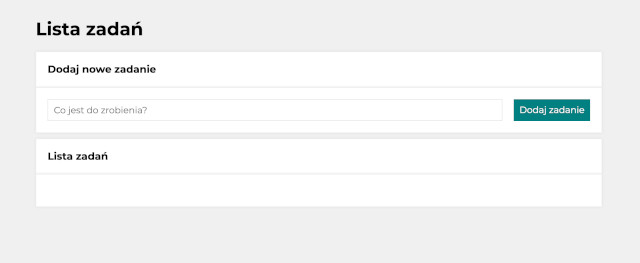
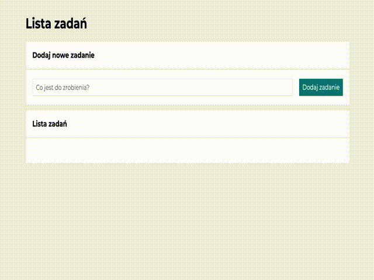
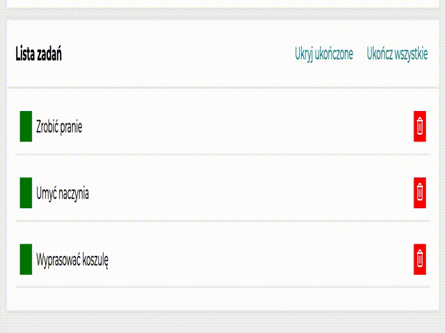

# "Lista zadań" 
To-Do List

---

## Overview

This repository contains a simple to-do list project written in the Polish language that helps you manage your tasks efficiently. This project is designed as a homework assignment for YouCode and provides a basic implementation of a to-do list using HTML, CSS, and Java

This project was bootstrapped with [Create React App](https://github.com/facebook/create-react-app).

---

## Usage Instruction

Here's how to use my project:

This screenshot shows the initial view of my application, which is the first thing users will see when they open it.

GIF above represents the usage of my To-Do List. You can add a new task by typing it in the 'Co jest do zrobienia?' (What needs to be done?) field, and then add it to the list using the 'Dodaj zadanie' (Add task) button.
You can change the status of a task to 'done' by clicking the green button. Alternatively, if you want to delete a specific task, you can click the red button.

You can check all tasks that have been completed simply by clicking the "Ukończ wszystkie" button, as shown in the GIF. Additionally, you can hide all completed tasks by clicking the "Ukryj ukończone" button.

---

## Tools 

- **Visual Studio Code**: A popular text editor that was used to write and edit the application's code.
- **Google Fonts**: A free online library of fonts that was used to enhance the application's typography and overall design.
- **Git/GitHub**: A version control system and online repository that was used to track changes to the application's code.

---

## Available Scripts

In the project directory, you can run:

### `npm start`

Runs the app in the development mode.\
Open [http://localhost:3000](http://localhost:3000) to view it in your browser.

The page will reload when you make changes.\
You may also see any lint errors in the console.

### `npm run build`

Builds the app for production to the `build` folder.\
It correctly bundles React in production mode and optimizes the build for the best performance.

The build is minified and the filenames include the hashes.\
Your app is ready to be deployed!

See the section about [deployment](https://facebook.github.io/create-react-app/docs/deployment) for more information.

### `npm run eject`

**Note: this is a one-way operation. Once you `eject`, you can't go back!**

If you aren't satisfied with the build tool and configuration choices, you can `eject` at any time. This command will remove the single build dependency from your project.

Instead, it will copy all the configuration files and the transitive dependencies (webpack, Babel, ESLint, etc) right into your project so you have full control over them. All of the commands except `eject` will still work, but they will point to the copied scripts so you can tweak them. At this point you're on your own.

You don't have to ever use `eject`. The curated feature set is suitable for small and middle deployments, and you shouldn't feel obligated to use this feature. However we understand that this tool wouldn't be useful if you couldn't customize it when you are ready for it.

---

## Contact

If you have any questions or feedback regarding this project, please feel free to contact me:

- Email: lenarmathias.contact@gmail.com
- GitHub: https://github.com/lenarmathias